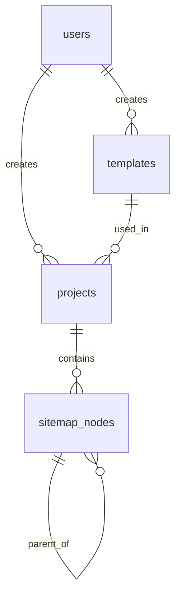

# Data Models

## Entity Relationship Diagram



## Tables/Collections

### users
**Description:** Application users (managed by Supabase Auth, extended with profile data)

| Column/Field | Type | Constraints | Description |
|--------------|------|-------------|-------------|
| id | UUID | PK, DEFAULT gen_random_uuid() | Primary identifier (matches Supabase auth.users.id) |
| email | VARCHAR(255) | NOT NULL, UNIQUE | User's email address |
| full_name | VARCHAR(255) | | User's display name |
| role | VARCHAR(50) | NOT NULL, DEFAULT 'user' | User role: 'admin' or 'user' |
| created_at | TIMESTAMPTZ | NOT NULL, DEFAULT NOW() | Record creation time |
| updated_at | TIMESTAMPTZ | | Last modification time |

**Relationships:**
- has_many: projects
- has_many: templates (if admin)

**Indexes:**
- `users_email_idx` on (email) - Fast lookup by email
- `users_role_idx` on (role) - Filter by role

**Access Control:**
| Operation | Who Can Perform | Condition |
|-----------|-----------------|-----------|
| SELECT | Authenticated | Own record only (id = auth.uid()) |
| INSERT | System | Via Supabase Auth trigger |
| UPDATE | Authenticated | Own record only |
| DELETE | Admin | Any user |

---

### templates
**Description:** Sitemap templates that define standard page structures for industries

| Column/Field | Type | Constraints | Description |
|--------------|------|-------------|-------------|
| id | UUID | PK, DEFAULT gen_random_uuid() | Primary identifier |
| name | VARCHAR(255) | NOT NULL | Template name (e.g., "Restoration Company") |
| description | TEXT | | Template description |
| structure | JSONB | NOT NULL | Nested page structure (see schema below) |
| services | JSONB | NOT NULL, DEFAULT '[]' | Available services for this template |
| url_patterns | JSONB | DEFAULT '{}' | URL pattern configurations |
| is_active | BOOLEAN | NOT NULL, DEFAULT true | Whether template is available for selection |
| created_by | UUID | FK users(id) | Admin who created the template |
| created_at | TIMESTAMPTZ | NOT NULL, DEFAULT NOW() | Record creation time |
| updated_at | TIMESTAMPTZ | | Last modification time |

**Structure JSONB Schema:**
```json
{
  "pages": [
    {
      "id": "home",
      "title": "Home",
      "url_pattern": "/",
      "children": []
    },
    {
      "id": "services",
      "title": "Services",
      "url_pattern": "/services",
      "children": [
        {
          "id": "water-damage",
          "title": "Water Damage Restoration",
          "url_pattern": "/water-damage",
          "multiply_in_matrix": true,
          "children": [
            {
              "id": "flood-cleanup",
              "title": "Flood Damage Cleanup",
              "url_pattern": "/water-damage/flood-cleanup",
              "multiply_in_matrix": true
            },
            {
              "id": "water-extraction",
              "title": "Water Extraction",
              "url_pattern": "/water-damage/water-extraction",
              "multiply_in_matrix": false
            }
          ]
        }
      ]
    },
    {
      "id": "service-areas",
      "title": "Service Areas",
      "url_pattern": "/service-areas",
      "is_location_parent": true,
      "children": []
    }
  ]
}
```

**Page Flags:**
- `multiply_in_matrix` (boolean): If true, generates location variants (e.g., "Miami Water Damage Restoration"). Can be set at ANY depth in the hierarchy.
- `is_location_parent` (boolean): Marks where location pages should be nested
- `is_service` (boolean): DEPRECATED - use `multiply_in_matrix` instead

**Services JSONB Schema:**
```json
[
  {
    "id": "water-damage",
    "name": "Water Damage Restoration",
    "url_slug": "water-damage",
    "category": "restoration"
  },
  {
    "id": "fire-damage",
    "name": "Fire Damage Restoration",
    "url_slug": "fire-damage",
    "category": "restoration"
  }
]
```

**Relationships:**
- belongs_to: users (via created_by)
- has_many: projects

**Indexes:**
- `templates_name_idx` on (name) - Search by name
- `templates_is_active_idx` on (is_active) - Filter active templates

**Access Control:**
| Operation | Who Can Perform | Condition |
|-----------|-----------------|-----------|
| SELECT | Authenticated | is_active = true OR role = 'admin' |
| INSERT | Admin | role = 'admin' |
| UPDATE | Admin | role = 'admin' |
| DELETE | Admin | role = 'admin' |

---

### projects
**Description:** User projects containing sitemap configurations and generated data

| Column/Field | Type | Constraints | Description |
|--------------|------|-------------|-------------|
| id | UUID | PK, DEFAULT gen_random_uuid() | Primary identifier |
| name | VARCHAR(255) | NOT NULL | Project name (e.g., "ABC Restoration Sitemap") |
| client_url | VARCHAR(500) | | Client's website URL |
| template_id | UUID | FK templates(id), NULLABLE | Selected template (null if none) |
| services_config | JSONB | NOT NULL, DEFAULT '[]' | Services enabled for this project |
| locations | JSONB | NOT NULL, DEFAULT '[]' | List of locations/cities |
| crawl_data | JSONB | | Raw crawl results from client site |
| comparison_result | JSONB | | AI comparison results |
| status | VARCHAR(50) | NOT NULL, DEFAULT 'draft' | Project status |
| created_by | UUID | FK users(id), NOT NULL | User who created the project |
| created_at | TIMESTAMPTZ | NOT NULL, DEFAULT NOW() | Record creation time |
| updated_at | TIMESTAMPTZ | | Last modification time |

**Services Config JSONB Schema:**
```json
[
  {
    "service_id": "water-damage",
    "enabled": true,
    "custom_name": null
  },
  {
    "service_id": "custom-biohazard",
    "enabled": true,
    "custom_name": "Biohazard Cleanup",
    "is_custom": true
  }
]
```

**Locations JSONB Schema:**
```json
[
  {
    "id": "miami",
    "name": "Miami",
    "url_slug": "miami"
  },
  {
    "id": "boca-raton",
    "name": "Boca Raton",
    "url_slug": "boca-raton"
  }
]
```

**Status Values:**
- `draft` - Initial state, being configured
- `crawled` - Client site has been crawled
- `compared` - AI comparison completed
- `finalized` - Sitemap finalized and ready for export
- `archived` - Project archived

**Relationships:**
- belongs_to: users (via created_by)
- belongs_to: templates (via template_id)
- has_many: sitemap_nodes

**Indexes:**
- `projects_created_by_idx` on (created_by) - User's projects
- `projects_status_idx` on (status) - Filter by status
- `projects_created_at_idx` on (created_at DESC) - Sort by date

**Access Control:**
| Operation | Who Can Perform | Condition |
|-----------|-----------------|-----------|
| SELECT | Authenticated | created_by = auth.uid() |
| INSERT | Authenticated | created_by = auth.uid() |
| UPDATE | Authenticated | created_by = auth.uid() |
| DELETE | Authenticated | created_by = auth.uid() |

---

### sitemap_nodes
**Description:** Individual pages/nodes in the generated sitemap

| Column/Field | Type | Constraints | Description |
|--------------|------|-------------|-------------|
| id | UUID | PK, DEFAULT gen_random_uuid() | Primary identifier |
| project_id | UUID | FK projects(id), NOT NULL, ON DELETE CASCADE | Parent project |
| title | VARCHAR(255) | NOT NULL | Page title displayed on block |
| url | VARCHAR(500) | | Generated URL for this page |
| page_type | VARCHAR(50) | NOT NULL | Type: 'standard', 'service', 'location', 'service_location' |
| parent_id | UUID | FK sitemap_nodes(id), NULLABLE | Parent node for nesting |
| source | VARCHAR(50) | NOT NULL | Source: 'template' or 'client' |
| client_original_url | VARCHAR(500) | | Original URL from client site (if source = 'client') |
| position | INTEGER | NOT NULL, DEFAULT 0 | Sort order among siblings |
| metadata | JSONB | DEFAULT '{}' | Additional metadata |
| created_at | TIMESTAMPTZ | NOT NULL, DEFAULT NOW() | Record creation time |
| updated_at | TIMESTAMPTZ | | Last modification time |

**Page Types:**
- `standard` - Regular page (Home, About, Contact)
- `service` - Service page (Water Damage, Fire Damage)
- `location` - Location page (Miami, Boca Raton)
- `service_location` - Combined service+location page (Miami Water Damage)

**Source Values:**
- `template` - Page from selected template
- `client` - Page imported from client's existing site

**Relationships:**
- belongs_to: projects (via project_id)
- belongs_to: sitemap_nodes (via parent_id, self-referential)
- has_many: sitemap_nodes (children)

**Indexes:**
- `sitemap_nodes_project_id_idx` on (project_id) - Get all nodes for project
- `sitemap_nodes_parent_id_idx` on (parent_id) - Get children
- `sitemap_nodes_source_idx` on (source) - Filter by source

**Access Control:**
| Operation | Who Can Perform | Condition |
|-----------|-----------------|-----------|
| SELECT | Authenticated | project.created_by = auth.uid() |
| INSERT | Authenticated | project.created_by = auth.uid() |
| UPDATE | Authenticated | project.created_by = auth.uid() |
| DELETE | Authenticated | project.created_by = auth.uid() |

---

## Enums/Constants

| Name | Values | Used By |
|------|--------|---------|
| user_role | 'admin', 'user' | users.role |
| project_status | 'draft', 'crawled', 'compared', 'finalized', 'archived' | projects.status |
| page_type | 'standard', 'service', 'location', 'service_location' | sitemap_nodes.page_type |
| node_source | 'template', 'client' | sitemap_nodes.source |

## Computed/Derived Fields

| Field | Computation | Where Used |
|-------|-------------|------------|
| Full URL | Combine domain + url_pattern + location slug | Sitemap display, export |
| Node depth | Count parent chain | Tree visualization |
| Project completion % | Status progression | Dashboard display |

## Row Level Security (RLS) Policies

```sql
-- Users: can only see/edit own profile
CREATE POLICY "Users can view own profile"
  ON users FOR SELECT
  USING (auth.uid() = id);

CREATE POLICY "Users can update own profile"
  ON users FOR UPDATE
  USING (auth.uid() = id);

-- Templates: all authenticated can view active, admins can manage
CREATE POLICY "Anyone can view active templates"
  ON templates FOR SELECT
  USING (is_active = true OR EXISTS (
    SELECT 1 FROM users WHERE id = auth.uid() AND role = 'admin'
  ));

CREATE POLICY "Admins can manage templates"
  ON templates FOR ALL
  USING (EXISTS (
    SELECT 1 FROM users WHERE id = auth.uid() AND role = 'admin'
  ));

-- Projects: users can only access own projects
CREATE POLICY "Users can manage own projects"
  ON projects FOR ALL
  USING (created_by = auth.uid());

-- Sitemap nodes: access through project ownership
CREATE POLICY "Users can manage nodes in own projects"
  ON sitemap_nodes FOR ALL
  USING (EXISTS (
    SELECT 1 FROM projects WHERE id = sitemap_nodes.project_id AND created_by = auth.uid()
  ));
```

---
⚠️ **AI INSTRUCTION:** When you modify any table/collection, UPDATE THIS FILE IMMEDIATELY before proceeding.
