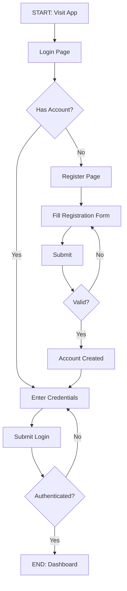
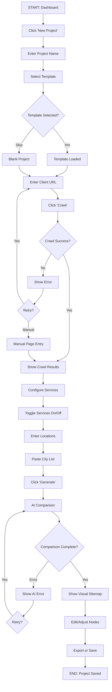
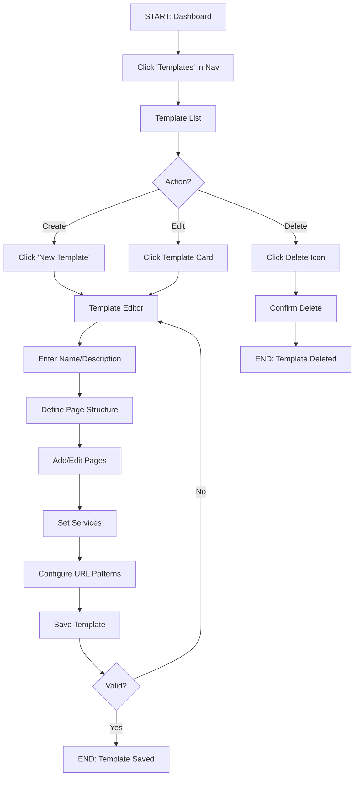
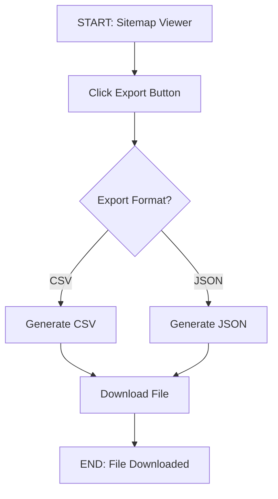
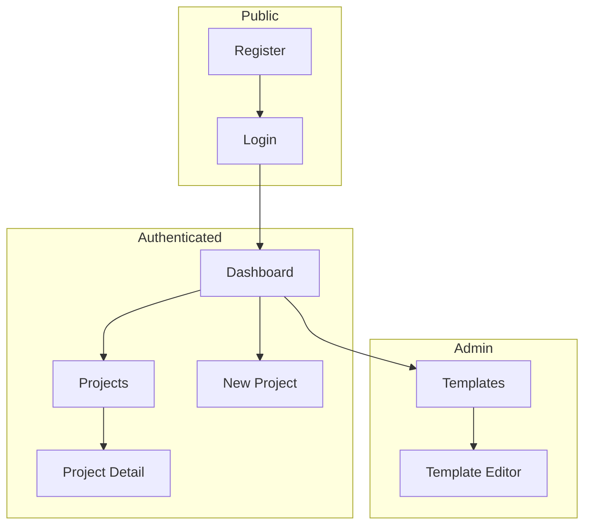

# App Flow

## User Journeys

### 1. New User Onboarding
**Actor:** New User (SEO Engineer)
**Goal:** Register and access the dashboard
**Preconditions:** User has been given access to register



**Steps:**
1. **Visit App:** User navigates to application URL → Screen: Login
2. **Register (if needed):** Click "Create Account" → Screen: Register
3. **Fill Form:** Enter email, password, name → Screen: Register
4. **Login:** Enter credentials → Screen: Login
5. **Dashboard:** View project list → Screen: Dashboard

**Error States:**
| Error | Trigger | User Sees | Recovery |
|-------|---------|-----------|----------|
| Invalid email format | Bad email input | "Please enter a valid email" | Fix email |
| Password too short | <8 characters | "Password must be 8+ characters" | Fix password |
| Email already exists | Duplicate registration | "Account already exists" | Login instead |
| Wrong credentials | Bad login | "Invalid email or password" | Retry or reset |

---

### 2. Create Sitemap (Core Flow)
**Actor:** User (SEO Engineer)
**Goal:** Generate a sitemap for a client website
**Preconditions:** User is logged in



**Steps:**
1. **New Project:** Click "New Project" button → Screen: Create Project
2. **Name Project:** Enter project name (e.g., "ABC Restoration") → Screen: Create Project
3. **Select Template:** Choose from dropdown or skip → Screen: Create Project
4. **Enter Client URL:** Input client website URL → Screen: Project Editor
5. **Crawl Site:** Click "Crawl" to fetch sitemap → Screen: Project Editor (loading)
6. **View Crawl Results:** See pages found → Screen: Project Editor
7. **Configure Services:** Toggle which services client offers → Screen: Service Config
8. **Enter Locations:** Paste list of cities/counties → Screen: Location Input
9. **Generate Sitemap:** Click "Generate" to run AI comparison → Screen: Project Editor (loading)
10. **View Sitemap:** See visual tree with color-coded nodes → Screen: Sitemap Viewer
11. **Edit (optional):** Adjust nodes, rename, reorder → Screen: Sitemap Viewer
12. **Export/Save:** Download CSV or save project → Screen: Sitemap Viewer

**Error States:**
| Error | Trigger | User Sees | Recovery |
|-------|---------|-----------|----------|
| Crawl timeout | Slow/unresponsive site | "Could not reach website" | Retry or manual entry |
| No sitemap found | Site lacks sitemap.xml | "No sitemap found" | Enter pages manually |
| AI comparison failed | Claude API error | "Comparison failed, please retry" | Retry button |
| Rate limited | Too many AI requests | "Please wait before retrying" | Wait 60 seconds |

---

### 3. Manage Templates (Admin Flow)
**Actor:** Admin
**Goal:** Create or edit a sitemap template
**Preconditions:** User is logged in with admin role



**Steps:**
1. **Access Templates:** Click "Templates" in sidebar (admin only) → Screen: Template List
2. **Create/Edit:** Click "New" or select existing → Screen: Template Editor
3. **Define Structure:** Add pages with nesting → Screen: Template Editor
4. **Set Services:** Define available services for this template → Screen: Template Editor
5. **Save:** Click "Save Template" → Screen: Template List

---

### 4. Export Sitemap
**Actor:** User
**Goal:** Export sitemap data for use elsewhere
**Preconditions:** Project has generated sitemap



**Steps:**
1. **Open Export:** Click "Export" dropdown in toolbar → Screen: Sitemap Viewer
2. **Select Format:** Choose CSV or JSON → Dropdown
3. **Download:** File downloads automatically → Browser download

---

## Screen Inventory

| Screen | Route | Purpose | Key Components | Auth Required |
|--------|-------|---------|----------------|---------------|
| Login | `/login` | User authentication | LoginForm | No |
| Register | `/register` | New user registration | RegisterForm | No |
| Dashboard | `/` | Project list, overview | ProjectList, CreateProjectButton | Yes |
| Create Project | `/projects/new` | New project wizard | ProjectForm, TemplateSelector | Yes |
| Project Editor | `/projects/[id]` | Main editing interface | CrawlForm, ServiceConfig, LocationInput, SitemapViewer | Yes |
| Template List | `/templates` | Admin template management | TemplateList, TemplateCard | Yes (Admin) |
| Template Editor | `/templates/[id]` | Create/edit templates | TemplateForm, PageStructureEditor | Yes (Admin) |

## Navigation Structure



## State Transitions

### Project Status
| From State | Action | To State | Side Effects |
|------------|--------|----------|--------------|
| (new) | Create project | draft | Project record created |
| draft | Crawl website | crawled | crawl_data populated |
| crawled | Run AI comparison | compared | comparison_result populated |
| compared | Save/finalize | finalized | Ready for export |
| any | Archive | archived | Hidden from default list |

### Sitemap Node Source
| Source | Color | Description |
|--------|-------|-------------|
| template | Blue (#3B82F6) | Page from selected template |
| client | Orange (#F97316) | Page imported from client site |

## UI Component Hierarchy

```
App
├── AuthLayout (public pages)
│   ├── LoginPage
│   └── RegisterPage
└── DashboardLayout (protected pages)
    ├── Header
    │   ├── Logo
    │   ├── Navigation
    │   └── UserMenu
    ├── Sidebar
    │   ├── ProjectsLink
    │   └── TemplatesLink (admin)
    └── MainContent
        ├── DashboardPage
        │   ├── ProjectList
        │   └── ProjectCard
        ├── ProjectEditorPage
        │   ├── ProjectHeader
        │   ├── CrawlSection
        │   │   ├── CrawlForm
        │   │   └── CrawlResults
        │   ├── ConfigSection
        │   │   ├── ServiceConfig
        │   │   └── LocationInput
        │   └── SitemapSection
        │       ├── SitemapToolbar
        │       └── SitemapViewer
        │           └── SitemapNode (recursive)
        └── TemplateEditorPage (admin)
            ├── TemplateForm
            └── PageStructureEditor
```

## Key User Interactions

### Sitemap Node Interactions
| Interaction | Action | Result |
|-------------|--------|--------|
| Click node | Select | Shows node details in panel |
| Double-click node | Edit | Opens inline editor |
| Drag node | Reorder | Changes position/parent |
| Right-click node | Context menu | Edit, delete, add child options |
| Hover node | Preview | Shows full URL tooltip |

### Keyboard Shortcuts
| Shortcut | Action | Context |
|----------|--------|---------|
| `Ctrl/Cmd + S` | Save project | Project editor |
| `Ctrl/Cmd + E` | Export CSV | Project editor |
| `Delete/Backspace` | Delete selected node | Sitemap viewer |
| `Escape` | Cancel edit | Node editor |
| `Enter` | Confirm edit | Node editor |
