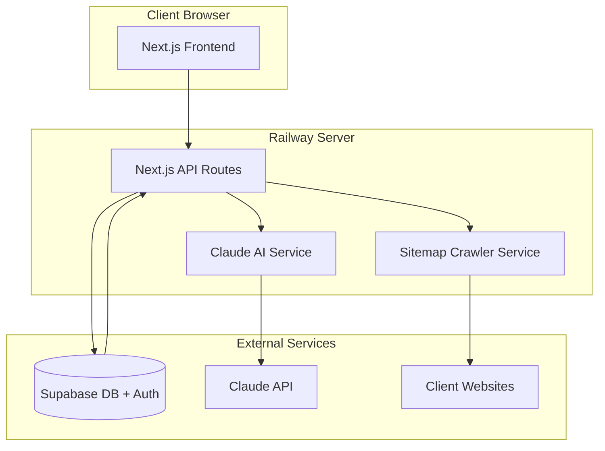

# System Context: AI Sitemap Builder

## Architecture Overview



## System Components

| Component | Technology | Responsibility | Communicates With |
|-----------|------------|----------------|-------------------|
| Frontend | Next.js (React) | User interface, sitemap visualization | API Routes |
| API Routes | Next.js API | Request handling, business logic | Supabase, Claude, Crawler |
| Crawler Service | Node.js (cheerio, axios) | Fetch and parse client sitemaps | Client Websites |
| AI Service | Claude API SDK | Semantic page comparison, matching | Claude API |
| Database | Supabase (PostgreSQL) | Data persistence, user management | API Routes |
| Authentication | Supabase Auth | User login, session management | Frontend, API Routes |

## Data Flow Summary

### Create Sitemap Flow
1. User authenticates via Supabase Auth
2. User creates project, selects template
3. User enters client URL
4. Crawler service fetches client sitemap XML
5. User configures services and locations
6. AI service compares template pages with client pages
7. System generates sitemap nodes with color coding
8. User views/edits visual sitemap
9. User exports to CSV or saves project

### Template Management Flow
1. Admin authenticates
2. Admin creates/edits template
3. Template structure saved to database
4. Template available for user selection

## External Dependencies

| Service | Purpose | Failure Impact |
|---------|---------|----------------|
| Supabase | Database + Auth | App non-functional (critical) |
| Claude API | Page comparison AI | Comparison feature unavailable, manual matching required |
| Client Websites | Source for sitemap data | Individual crawl fails, user can manually input |

## Key Architectural Decisions

| Decision | Rationale | Date |
|----------|-----------|------|
| Next.js full-stack | Single deployment, React preference, excellent Supabase integration | 2025-02-05 |
| Supabase over custom auth | Built-in auth + DB, faster development, proven reliability | 2025-02-05 |
| Claude over GPT-4 | User has existing API key, strong semantic understanding | 2025-02-05 |
| Node.js crawling over Python | Keeps stack unified, sufficient for ~5 sites/month volume | 2025-02-05 |
| Railway hosting | User's existing platform, simple deployment | 2025-02-05 |

## Security Boundaries

```
┌─────────────────────────────────────────────────────────────┐
│                      PUBLIC ZONE                            │
│  - Login page                                               │
│  - Register page                                            │
└─────────────────────────────────────────────────────────────┘
                              │
                              ▼ (Supabase Auth)
┌─────────────────────────────────────────────────────────────┐
│                   AUTHENTICATED ZONE                        │
│  - Dashboard                                                │
│  - Project CRUD                                             │
│  - Sitemap generation                                       │
│  - Export features                                          │
└─────────────────────────────────────────────────────────────┘
                              │
                              ▼ (Role check: admin)
┌─────────────────────────────────────────────────────────────┐
│                      ADMIN ZONE                             │
│  - Template management                                      │
│  - User management (future)                                 │
│  - API usage dashboard (future)                             │
└─────────────────────────────────────────────────────────────┘
```

## Performance Considerations

| Concern | Mitigation |
|---------|-----------|
| Large sitemap crawls | Implement pagination, timeout limits (30s max) |
| Claude API latency | Show loading state, cache comparison results |
| Complex sitemap rendering | Use virtualization for large trees, lazy loading |
| Database queries | Index frequently queried columns, use Supabase query optimization |
